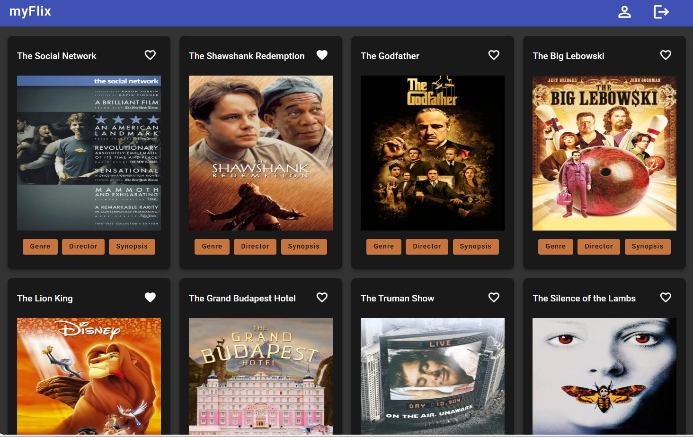

# MyFlixAngularClient

### Description of the Angular Movie App app

MyFlix Angular Client is a single-page, responsive application with which users can find out more about movies they are interested in, including information about genres and directors. Users' profile and personal information can be saved and updated and a list of favourite movies can be created in the app. Systems and programs used:

* Angular, Angular CLI
* HTML, CSS
* MERN tech stack (MongoDB, Express, React, Node.js)
  

 

### Film App link

App URL: https://maaikevp.github.io/myflix-angular-client/welcome

 
 

### Screenshot of app

This project was generated with [Angular CLI](https://github.com/angular/angular-cli) version 17.3.5.

 

## Development server

Run `ng serve` for a dev server. Navigate to `http://localhost:4200/`. The application will automatically reload if you change any of the source files.

## Code scaffolding

Run `ng generate component component-name` to generate a new component. You can also use `ng generate directive|pipe|service|class|guard|interface|enum|module`.

## Build

Run `ng build` to build the project. The build artifacts will be stored in the `dist/` directory.

## Running unit tests

Run `ng test` to execute the unit tests via [Karma](https://karma-runner.github.io).

## Running end-to-end tests

Run `ng e2e` to execute the end-to-end tests via a platform of your choice. To use this command, you need to first add a package that implements end-to-end testing capabilities.

## Further help

To get more help on the Angular CLI use `ng help` or go check out the [Angular CLI Overview and Command Reference](https://angular.io/cli) page.
